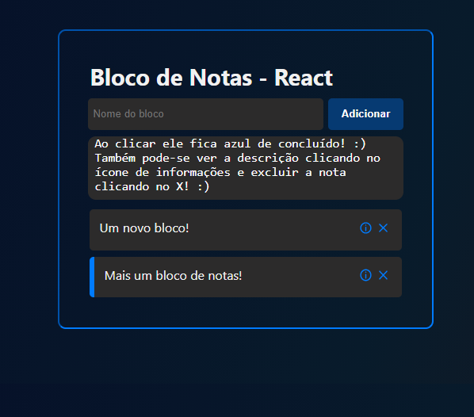

<h1 align='center'>
    Bloco de Notas - React
</h1>

# 🤔 Sobre

O projeto **Bloco de Notas - React** é um site desenvolvido em React que simula um bloco de notas.

# 💻Tecnologias utilizadas

- [React](https://pt-br.reactjs.org/)
# 😮 Preview

<h2>
    
    
    
    
</h2>
